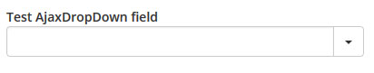
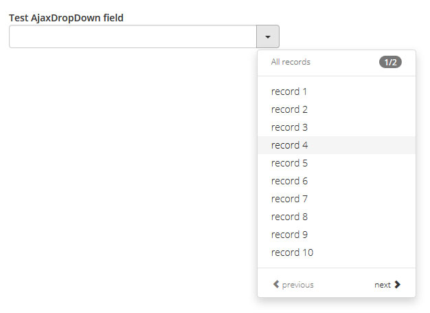
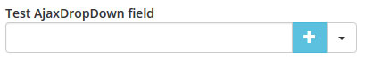
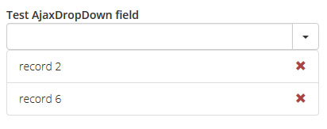

# Yii2-AjaxDropDown
Yii 2.0 dropdown widget with AJAX data

AjaxDropDown allows to use dropdown menu to select one or more values in your form. Dropdown data is sent using the AJAX post method.

## How it works

The widget collects AJAX data and displays it as the list where every element can be clicked to select that value for the model attribute. The number of results per page is controlled by the source controller action. After first page the widget collects new page data only when the 'next' button is clicked and that target page has not been collected already. In any other case the data is present all the time and browsing through the already loaded pages takes no server time. The idea behind the input text field next to the dropdown button is to give the option to filter the source data before displaying it in the widget but there are no requirements for this so feel free to add any logic here you like.

## Screenshots

_Default view:_ 

_Dropdown list visible: (option 'dropup' is available as well)_ 

_Extra button:_ 

_Records selected:_ 

## How to install

Update your composer.json with

    {
      "require": {
        "bizley/ajaxdropdown": "*"
      }
    }

and run composer update.
After installation add the following inside your view (change to suit your needs):

    <?= \bizley\ajaxdropdown\AjaxDropdown::widget([
      'model' => $model,
      'attribute' => 'attribute',
      'source' => \yii\helpers\Url::to(['source']),
    ]); ?>
    
This is just a basic widget configuration. You can find all the options described in the AjaxDropDown.php and docs files.

## Full widget structure with possible options

    

        

            <input {type="text" name="ajaxDropDownInput" value="" class="{inputClass}" {style="{inputStyle}"} inputOptions}>
            <input type="hidden" value="[SELECTED_ID]" name="[ATTRIBUTE_NAME]" class="singleResult">
            

                {<button type="button" {extraButtonOptions}>{extraButtonLabel}</button>}
                <button data-page="[DATA_PAGE]" data-toggle="dropdown" type="button" class="ajaxDropDownToggle {buttonClass}" {style="{buttonStyle}"}>
                    {buttonLabel}
                </button>
                <button type="button" class="ajaxDropDownSingleRemove {removeSingleClass}" {style="{removeSingleStyle}"}>
                    {removeSingleLabel}
                </button>
                <ul role="menu" class="ajaxDropDownMenu {resultsClass}" {style="{resultsStyle}"}>
                    <li class="dropdown-header {headerClass}" {style="{headerStyle}"}>
                        {pagerBegin}
                            [CURRENT_PAGE_NUMBER]/[TOTAL_PAGES_NUMBER]
                        {pagerEnd}{local.allRecords|local.recordsContaining}
                    </li>
                    <li class="divider"></li>
                    <li class="ajaxDropDownLoading {loadingClass}" {style="{loadingStyle}"}>{progressBar}</li>
                    <li class="dropdown-header {errorClass}" {style="{errorStyle}"}>{local.error}</li>
                    <li class="dropdown-header {noRecordsClass}" {style="{noRecordsStyle}"}>{local.noRecords}</li>
                    <li class="ajaxDropDownPages ajaxDropDownPage[PAGE_NUMBER] ajaxDropDownRecord[RECORD_ID] {recordClass}" {style="{recordStyle}"}>
                        <a data-id="[RECORD_ID]" class="ajaxDropDownResult" href="#">{markBegin}[RECORD_VALUE]{markEnd}</a>
                    </li>
                    <li class="divider ajaxDropDownInfo"></li>
                    <li class="ajaxDropDownInfo {switchClass}" {style="{switchStyle}"}>
                        <a class="ajaxDropDownPrev {previousClass}" {style="{previousStyle}"} href="#">
                            {previousBegin}{local.previous}{previousEnd}
                        </a>
                        <a class="ajaxDropDownNext {nextClass}" {style="{nextStyle}"} href="#">
                            {nextBegin}{local.next}{nextEnd}
                        </a>
                    </li>
                </ul>
            

        

        <ul class="ajaxDropDownResults {selectedClass}" {style="{selectedStyle}"}>
            <li class="ajaxDropDownSelected[SELECTED_ID] {resultClass}" {style="{resultStyle}"}>
                <a class="ajaxDropDownRemove {removeClass}" {style="{removeStyle}"} href="#" data-id="[SELECTED_ID]">
                    {removeLabel}
                </a>{additionalCode}{markBegin}[SELECTED_VALUE]{markEnd}<input type="hidden" value="[SELECTED_ID]" name="[ATTRIBUTE_NAME]">
            </li>
        </ul>
    

    
Names in curly brackets are options and can be set as widget parameters. Names in square brackets are automatically set widget data.

## AJAX data source

Below is the structure required by this widget:

    [
      'data' => [
        [
          'id' => RECORD_ID,
          'mark' => RECORD_EMPHASIS,
          'value' => RECORD_VALUE
        ],
        // ...
      ],
      'page' => CURRENT_PAGE_NUMBER,
      'total' => TOTAL_PAGES_NUMBER
    ]
    
Where: 
RECORD_ID is the record unique identificator, 
RECORD_EMPHASIS is the 0|1 flag wheter this record value should be surrounded with {markBegin} and {markEnd}, 
RECORD_VALUE is the record actual value, 
CURRENT_PAGE_NUMBER is the actual page number (starting from 1), 
TOTAL_PAGES_NUMBER is the number of all available pages.

This should be JSON encoded. You can find the example in the docs files.

## Preselected and post-validate data with PHP.

In case you want to display some records as already selected or simply just want to keep the selected data after validation you need to prepare the 'data' parameter which is the array almost identical to the source one.

    [
      [
        'id' => RECORD_ID,
        'mark' => RECORD_EMPHASIS,
        'value' => RECORD_VALUE
      ],
      // ...
    ]
    
This time the array shouldn't be encoded. Keep this structure even in case of a single result.

You can find the controller's action example in docs files.

## Preselected and post-validate data with JavaScript.

You can manipulate selected results by triggering the following events on AjaxDropDown object:

**add** 
Add one or more results. In case the _'singleMode'_ is true only the last added result will be displayed.

    jQuery({id or class of AjaxDropDown field}).trigger('add', [result1, result2, ...]);

With every result data being object with _id_, _value_, _mark_ and _additional_ properties (only _id_ is required):

    {id:1, value:"xxx", mark:0, additional:"xxx"}

**removeOne** 
Remove one or more results.

    jQuery({id or class of AjaxDropDown field}).trigger('removeOne', [id1, id2, ...]);

**removeAll** 
Remove all results.

    jQuery({id or class of AjaxDropDown field}).trigger('removeAll');

By default events (except 'removeAll') are calling callback methods _onRemove_ and _onSelect_. You can change it by setting _'jsEventsCallback'_ to false.

## Available extra options

**Drop up** 
Set _'dropup' => true_ to trigger dropdown menu above to button.

**Additional button** 
Set _'extraButtonLabel'_ and/or _'extraButtonOptions'_ to add extra button between input text field and dropdown trigger button.

**Additional code** 
Set _'additionalCode'_ if you want to add an extra code between link removing the selected result and selected result label. You can use {ID} and {VALUE} tags to get these automatically replaced with selected data. You can replace this general option for only one row by setting _'additional'_ array element in _'data'_ parameter.

**Single mode** 
Set _'singleMode'_ to true if you want only one result to be selectable at once. This option renders selected result inside the filter field - if you want it to be displayed underneath the field set _'singleModeBottom'_ to true.

**Callbacks** 
Pass any JavaScript function as a string to _'onSelect'_ and _'onRemove'_ parameters to call them when selecting or removing the results from the list. In first case available variables are _id_ (ID of the result), _label_ (its label) and _selection_ (list of all selected results). In second case only _id_ and _selection_ are available.